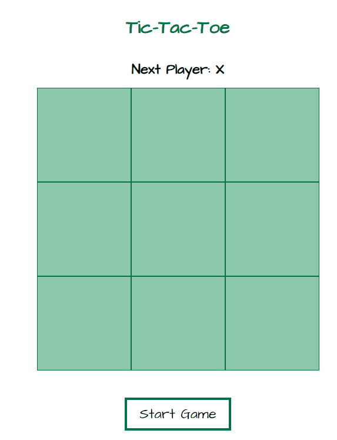

# Tic Tac Toe

A React Web app made with a Test Driven Development approach. You can play the game [here](https://jolly-northcutt-c6310b.netlify.app/)
## Preview


## Installation

You can run the Web app locally with the following commands:

```markdown
git clone https://github.com/2021-DEV1-089/tic-tac-toe.git
cd tic-tac-toe
npm install
npm start
```
navigate to `http://localhost:3000` on your browser.

Note: Node and npm need to be installed. Learn more on how to install it [here](https://docs.npmjs.com/downloading-and-installing-node-js-and-npm)


## Testing

This Web app uses [Jest](https://jestjs.io/fr/) as a testing libray.

### To run the tests:

Type `npm run test` in the terminal
